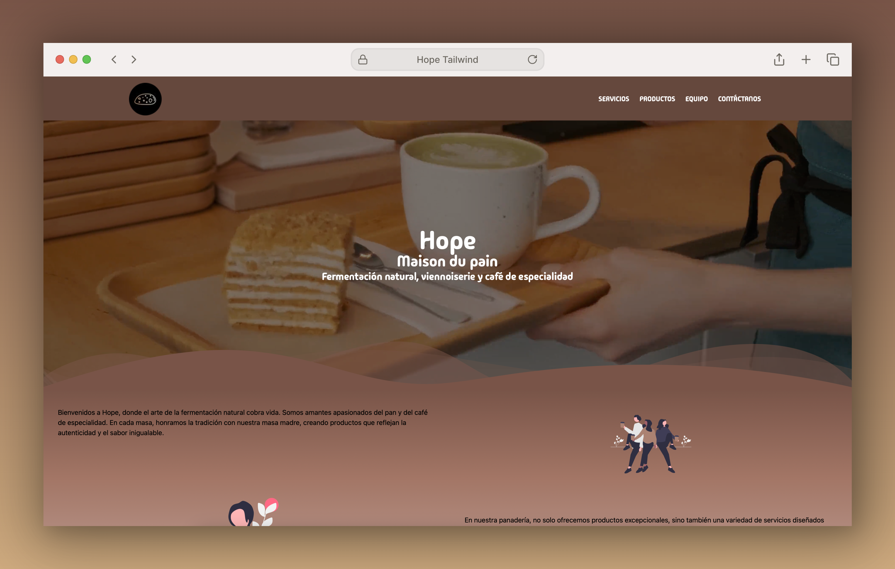
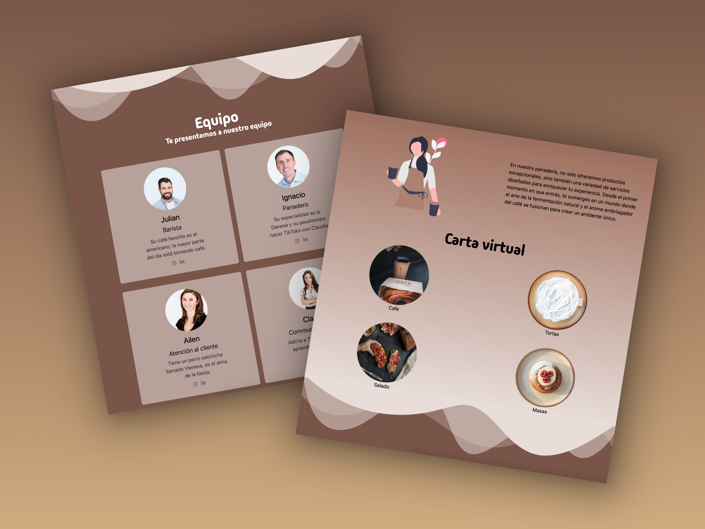
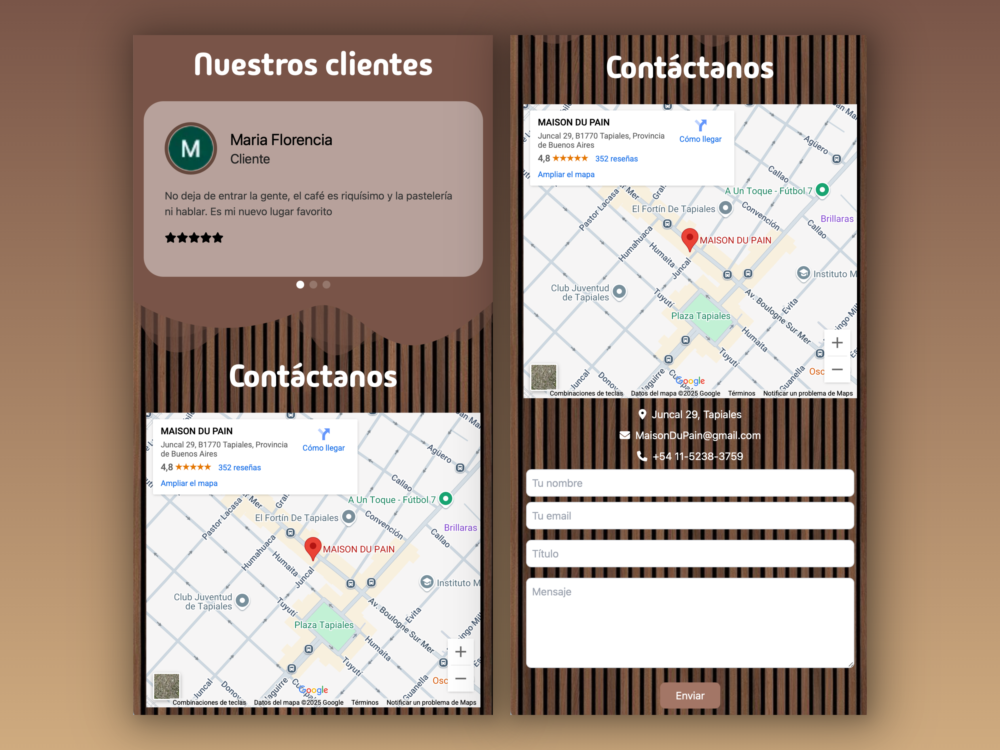
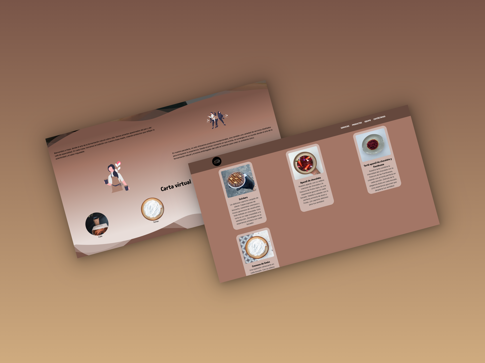

# ⚛️ Proyecto Hope Tailwind
¡Bienvenido/a al repositorio de Hope Tailwind!

## 📦 Descripción del Proyecto
Volví a trabajar en la página que diseñé y desarrollé para hope, pero esta vez utilizando ReactJS y Tailwind CSS. Con esta actualización, mejoré la estructura y el diseño para hacerla más dinámica y optimizada. Se trata de una landing page para la panadería hope, ahora con una experiencia más fluida y moderna.

## 🛠️ Herramientas principales
 
 
 
 
 
 

## 📸 Imagenes del proyecto

## ❔Donde puedo ver el proyecto? 
Puedes ver el proyecto en: [Universe Factory Shop](https://hope-tailwind.vercel.app).
